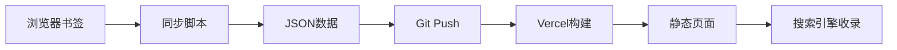

# AI123 导航站 - 可持续架构设计

## 核心理念
1. **自动同步**: 浏览器收藏夹 → 导航站数据
2. **GEO优化**: 结构化数据让搜索引擎和AI理解
3. **开放数据**: JSON-LD + API 供其他系统调用

---

## 1. 自动更新机制

### 方案A: 浏览器扩展 (推荐)
```
Chrome Extension → 监听书签变化 → 上传到 GitHub/Gist → Vercel 自动部署
```

### 方案B: 定时同步脚本
```bash
# 本地定时任务
python scripts/sync_bookmarks.py --watch
```

### 方案C: 云端同步
```
浏览器 → 云同步 → iCloud/Google → API → 导航站
```

---

## 2. GEO (生成式引擎优化) 实现

### 2.1 JSON-LD 结构化数据
每个工具页面包含:
```json
{
  "@context": "https://schema.org",
  "@type": "SoftwareApplication",
  "name": "工具名称",
  "url": "官网链接",
  "description": "描述",
  "applicationCategory": "AI工具",
  "operatingSystem": "Web",
  "offers": {
    "@type": "Offer",
    "price": "0",
    "priceCurrency": "CNY"
  }
}
```

### 2.2 语义化 HTML
```html
<article itemscope itemtype="https://schema.org/SoftwareApplication">
  <h1 itemprop="name">工具名</h1>
  <p itemprop="description">描述</p>
  <link itemprop="url" href="...">
</article>
```

### 2.3 sitemap.xml 自动生成
- 每个工具独立页面
- 分类索引页
- 标签云页面

---

## 3. 数据结构

### public/data/
```
ai-tools-full.json    # 完整数据 (含元信息)
ai-tools-simple.json  # 精简版 (嵌入HTML)
sitemap.xml           # SEO地图
schema.jsonld         # 结构化数据
```

---

## 4. API 端点

### GET /api/tools
返回所有工具列表

### GET /api/tools/:category
按分类返回工具

### GET /api/search?q=keyword
搜索工具

### POST /api/sync
触发同步 (需要认证)

---

## 5. 部署流程



---

## 6. 下一步行动

1. [x] 解析现有收藏夹
2. [ ] 创建浏览器扩展
3. [ ] 实现 JSON-LD
4. [ ] 生成 sitemap.xml
5. [ ] 添加搜索功能
6. [ ] 提交到搜索引擎