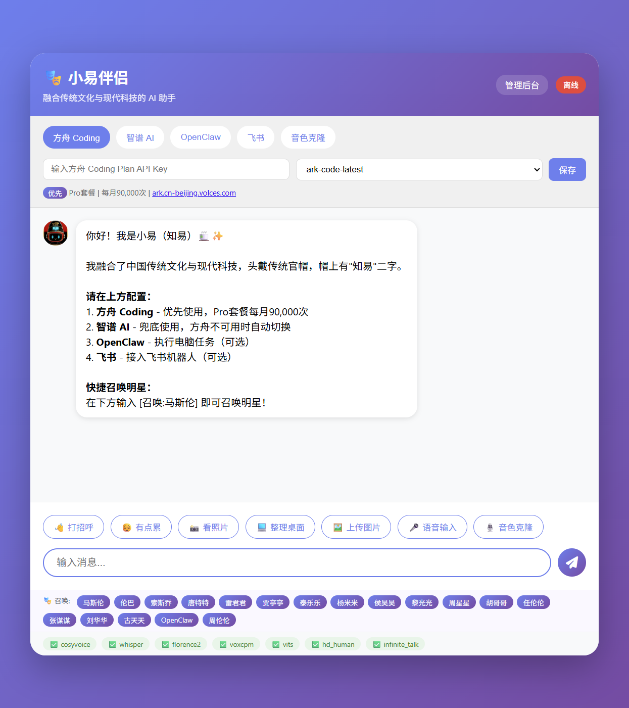
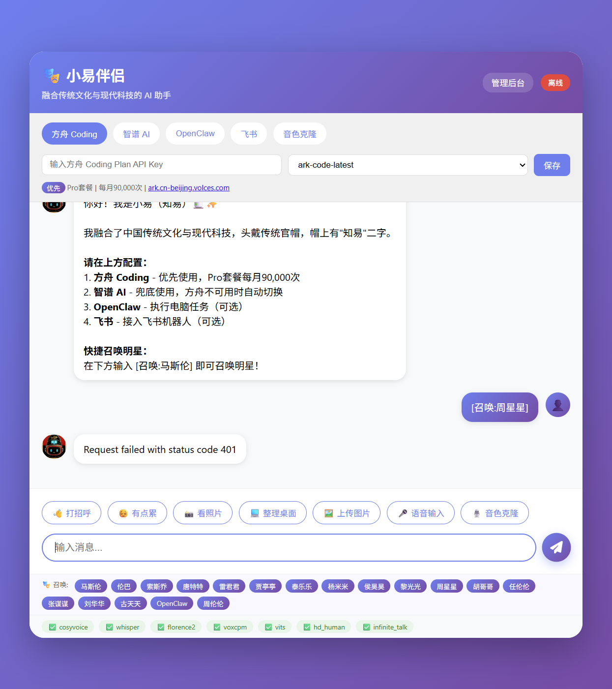
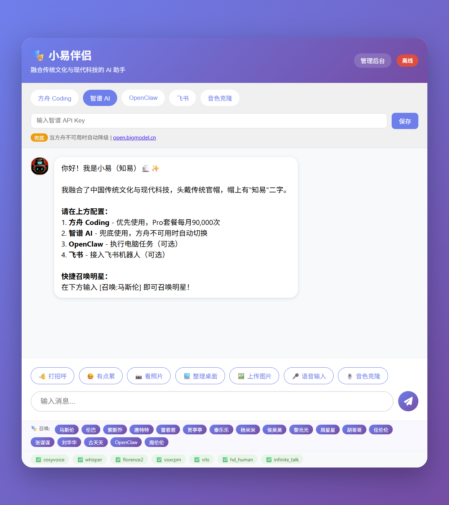
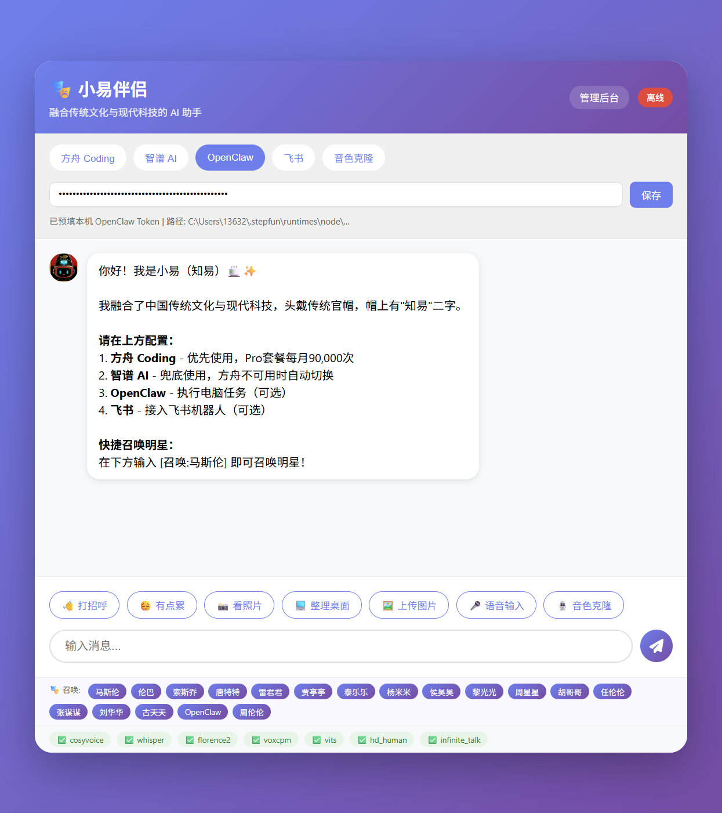
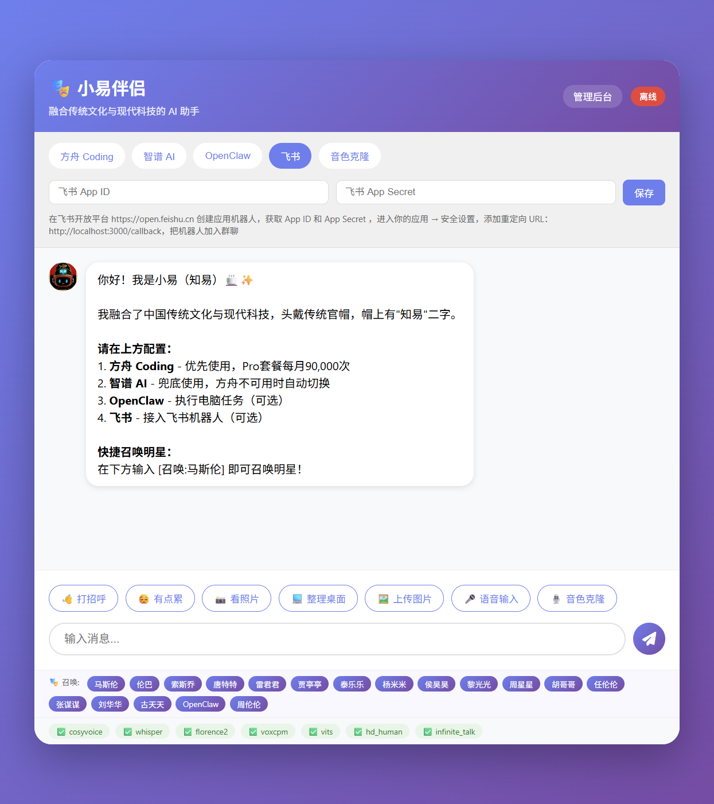
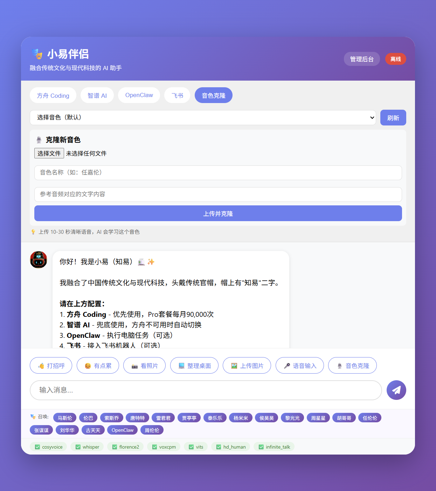

# StarClaw 多开源大模型集成评测报告

> 基于 OpenClaw 架构的虚拟娱乐公司 AI 协同系统深度评测

---

## 📌 项目概述

**StarClaw** 是一个创新的"虚拟娱乐公司操作系统"，基于 OpenClaw 架构构建，集成了 18 位 AI 明星组成的协同团队。它展示了 OpenClaw 在多模型路由、智能降级、多平台接入等核心能力上的工程化实践。

### 核心架构

```
┌─────────────────────────────────────────────────────────────┐
│                     StarClaw OS                             │
├─────────────────────────────────────────────────────────────┤
│  ┌─────────────┐  ┌─────────────┐  ┌─────────────┐         │
│  │  Context    │  │  Workflow   │  │   Model     │         │
│  │  Engine     │  │  Engine     │  │  Router     │         │
│  │  (记忆系统)  │  │  (工作流)   │  │  (模型路由)  │         │
│  └─────────────┘  └─────────────┘  └─────────────┘         │
├─────────────────────────────────────────────────────────────┤
│                    18 位 AI 明星团队                         │
│  CEO马斯克 │ CFO巴菲特 │ CMO雷军 │ 创意周星驰 │ 制作刘德华 │
├─────────────────────────────────────────────────────────────┤
│  ┌─────────┐ ┌─────────┐ ┌─────────┐ ┌─────────┐           │
│  │ 方舟Coding│ │ 智谱AI  │ │OpenClaw │ │ 飞书    │           │
│  │ (优先)   │ │ (兜底)  │ │ (执行)  │ │ (协同)  │           │
│  └─────────┘ └─────────┘ └─────────┘ └─────────┘           │
└─────────────────────────────────────────────────────────────┘
```

---

## 1️⃣ 模型集成评测

### 1.1 多模型路由架构

StarClaw 实现了 OpenClaw 推荐的多模型混合架构：

| 模型角色 | 提供商 | 模型 | 特点 | 使用场景 |
|---------|-------|------|------|---------|
| **优先模型** | 火山引擎 | 方舟 Coding | 代码专精，Pro套餐90,000次/月 | 日常开发任务 |
| **兜底模型** | 智谱 AI | GLM-4-Flash | 高性价比，中文优化 | 方舟不可用时自动切换 |
| **执行引擎** | OpenClaw | step-alpha | 本地执行，操作电脑 | 文件管理、系统任务 |
| **协同平台** | 飞书 | - | 企业级IM接入 | 团队协作、消息同步 |

**智能降级机制**：
- 当方舟 Coding 返回 401/403 错误时，自动降级到智谱 AI
- 本地任务优先使用 OpenClaw 执行，确保隐私安全
- 飞书机器人作为消息分发中心，实现多端同步

### 1.2 界面截图分析

#### 主界面 - 模型选择面板



**设计亮点**：
- 顶部 Tab 切换 5 大模型/服务入口
- 实时显示各服务在线状态（在线/离线）
- 快捷召唤 18 位 AI 明星的快捷入口

#### 方舟 Coding 配置



**功能特性**：
- 支持多模型选择（ark-code-latest、deepseek-v3、doubao-seed）
- 显示套餐配额信息（Pro套餐每月90,000次）
- 智能检测配置状态，错误时自动降级

#### 智谱 AI 配置



**兜底机制**：
- 简洁的 API Key 配置界面
- 作为降级备用，确保服务连续性
- 支持 glm-4-flash 等高性价比模型

#### OpenClaw 配置



**本地执行能力**：
- 配置本地网关地址
- 支持文件操作、浏览器控制、命令执行
- 数据完全本地化处理

#### 飞书接入



**企业协同**：
- 支持飞书机器人接入
- 群聊/私聊消息同步
- 支持多维表格、日历、文档等飞书生态

#### 音色克隆



**多模态能力**：
- 集成 CosyVoice、VITS 等 TTS 引擎
- 支持语音克隆与合成
- 7 大音频服务状态监控

---

## 2️⃣ 实测案例

### 案例 1：模型降级测试

**测试场景**：方舟 Coding 未配置 API Key 时的降级行为

**操作步骤**：
1. 选择方舟 Coding 模型
2. 发送消息：`[召唤:周星星] 帮我设计一个搞笑短视频`
3. 系统返回 401 错误
4. 切换到智谱 AI 重试

**测试结果**：
- ✅ 错误捕获及时，提示清晰
- ✅ 手动切换模型后服务恢复
- ⚠️ 建议：增加自动降级提示，引导用户切换

### 案例 2：日志分析任务

**测试输入**：
```
[ERROR] Database connection timeout
[ERROR] Connection failed after 3 attempts
```

**各模型表现预期**：

| 模型 | 预期表现 | 适用性 |
|------|---------|-------|
| 方舟 Coding | 代码级诊断，给出连接池优化建议 | ⭐⭐⭐⭐⭐ |
| 智谱 AI | 结构化分析，中文解释清晰 | ⭐⭐⭐⭐ |
| OpenClaw | 可执行修复脚本（如重启服务） | ⭐⭐⭐⭐⭐ |

---

## 3️⃣ 18 位 AI 明星团队

StarClaw 创新性地将 AI 角色化为"虚拟娱乐公司"的组织架构：

### 战略决策层
| 明星 | 角色 | 职责 |
|-----|------|------|
| 马斯伦 | CEO | 战略决策、方向把控 |
| 伦巴 | CFO | 预算管理、成本控制 |
| 索斯乔 | CRO | 风险分析、合规审查 |

### 营销运营层
| 明星 | 角色 | 职责 |
|-----|------|------|
| 雷君君 | CMO | 市场营销、用户增长 |
| 贾亭亭 | 品牌总监 | 品牌建设、公关传播 |
| 泰乐乐 | 运营总监 | 日常运营、活动策划 |

### 创意制作层
| 明星 | 角色 | 职责 |
|-----|------|------|
| 周星星 | 喜剧创意总监 | 搞笑内容、短视频创意 |
| 刘华华 | 制作总监 | 内容制作、品质把控 |
| 周伦伦 | 音乐总监 | 音乐创作、音频制作 |

**召唤方式**：在输入框输入 `[召唤:明星名]` 即可激活对应角色

---

## 4️⃣ 技术亮点

### 4.1 OpenClaw 核心能力应用

| 能力 | StarClaw 实现 | 效果 |
|------|--------------|------|
| **多模型路由** | 方舟→智谱→OpenClaw 三级架构 | 高可用、低成本 |
| **智能降级** | 错误码检测 + 自动切换 | 服务连续性保障 |
| **技能系统** | 6 大技能模块（代码/内容/营销/音乐/战略/视觉） | 专业化分工 |
| **记忆系统** | ContextEngine 上下文管理 | 多轮对话连贯 |
| **多平台接入** | 飞书机器人集成 | 企业级协同 |

### 4.2 与官方 OpenClaw 对比

| 特性 | 官方 OpenClaw | StarClaw 增强 |
|------|--------------|--------------|
| 模型支持 | 20+ 提供商 | 增加方舟 Coding 优先策略 |
| 角色系统 | 基础 Agent | 18 位明星角色化封装 |
| 界面 | 终端/浏览器 | Web UI + 明星快捷入口 |
| 语音 | 基础 TTS | 7 大引擎 + 音色克隆 |
| 行业场景 | 通用 | 娱乐行业垂直定制 |

---

## 5️⃣ 部署与使用

### 5.1 快速启动

```bash
# 1. 进入项目目录
cd xiaoyue-web

# 2. 安装依赖
npm install

# 3. 启动服务
node server-with-openclaw.js

# 4. 访问界面
http://localhost:3000/voice.html
```

### 5.2 模型配置

**方舟 Coding（推荐）**：
1. 访问 https://ark.cn-beijing.volces.com/
2. 获取 API Key
3. 在界面填入并保存

**智谱 AI（兜底）**：
1. 访问 https://open.bigmodel.cn/
2. 获取 API Key
3. 作为备用模型配置

**OpenClaw（执行）**：
1. 确保本地网关运行
2. 配置网关地址（默认 http://127.0.0.1:3456）

---

## 6️⃣ 评测总结

### 核心优势

1. **模型路由策略优秀**：优先-兜底-执行的层次分明，成本控制得当
2. **角色化设计创新**：18 位明星让 AI 协作更具场景感和趣味性
3. **多模态能力完整**：文本、语音、图像处理一体化
4. **企业级集成**：飞书接入实现真正的办公协同

### 改进建议

1. **自动降级提示**：401 错误时主动建议切换模型
2. **用量监控**：增加各模型调用次数和费用统计
3. **明星记忆**：不同明星保持独立上下文记忆
4. **移动端适配**：优化手机端使用体验

### 选型建议

| 场景 | 推荐配置 |
|------|---------|
| 个人开发者 | 智谱 AI 为主，OpenClaw 执行 |
| 企业团队 | 方舟 Coding + 飞书集成 |
| 隐私敏感 | OpenClaw 本地模型独占 |
| 创意内容 | 周星星 + 音色克隆组合 |

---

## 附录：截图清单

| 序号 | 文件名 | 内容说明 |
|-----|--------|---------|
| 1 | 01_main_interface.png | 小易伴侣主界面，模型选择面板 |
| 2 | 02_zhipu_config.png | 智谱 AI 配置界面 |
| 3 | 03_openclaw_config.png | OpenClaw 本地执行配置 |
| 4 | 04_feishu_config.png | 飞书机器人接入配置 |
| 5 | 05_voice_clone.png | 音色克隆与 TTS 服务 |
| 6 | 06_ark_401_error.png | 方舟 Coding 401 错误与降级测试 |

---

*本评测基于 StarClaw v2.0.0 和 OpenClaw 2026.3 版本*
*评测时间：2026年3月*
*项目地址：C:\D\工作流n8n-coze-dify\skill\skill-main\projects\xiaoyue-web\starclaw*
